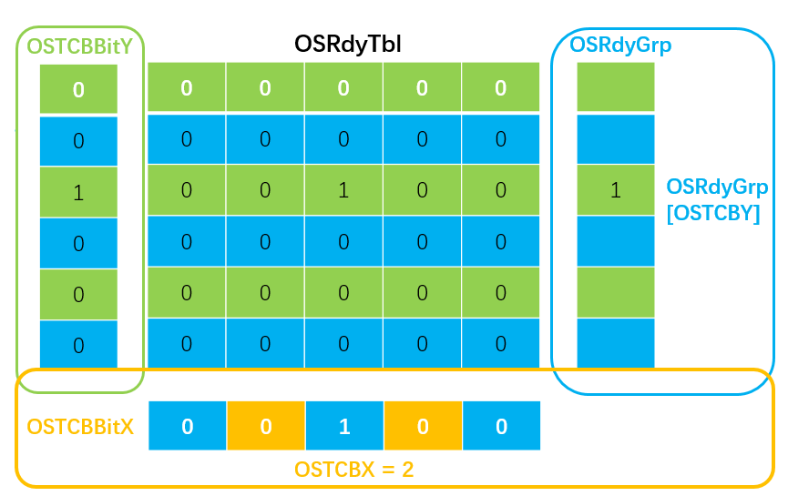

# 1、基本的代码框架

## 1.1、STM32移植代码关系图


## 1.2、 V2.86 ucos-II 代码结构

***Source和 Port 是我们最为关心的地方***


# 2、main函数源码解读

前言：每一个函数只是介绍其基本的内容和功能，具体参数请参考官网源码中的注释，很详细的

> ucos-II仅仅是一个库，刚刚接手源代码，往往让人不知所以，根本不知道代码要从什么地方开始看，结果就是看得一头雾水，很快就放弃了。
>
> 我们从一个已经移植到STM32F103ZE系列单片机并且能够跑通的源代码的main函数还是分析。
>
> ```c
> //main函数的源代码
> #include "includes.h"
> OS_STK startup_task_stk[STARTUP_TASK_STK_SIZE];
> int main(void)
> {
>   	BSP_Init();
> 	OSInit();
> 	OSTaskCreate(Task_Start,(void *)0,
> 	   &startup_task_stk[STARTUP_TASK_STK_SIZE-1], STARTUP_TASK_PRIO);
> 
> 	OSStart();
>     return 0;
>  }
> ```
>
> 各个函数的大致功能如下
>
> * 硬件初始化：初始化硬件的驱动程序  board support package 板上支持包。初始化ADC引脚，定时器等
> * 操作系统初始化：创建系统任务，新建控制块链表
> * 创建用户任务：需要输入任务堆栈区，任务函数指针，优先级大小
> * 然后启动操作系统，开始任务的切换


## 2.1、BSP.c


程序是关于

* 外部设备的初始化
* 一些寄存器的操作API

* 设备中断服务程序

## 2.2、OS_Core.c

### void OSInit(void)

* 初始化中断嵌套计数器，任务数量，系统启动标志位false，任务上下文切换计数器，空闲计数器OSIdleCtr

* 初始化就绪任务表OSRdyTbl【OS_RDY_TBL_SIZE】和 就绪组int OSRdyGrp

* 初始化任务控制块OSTCBFreeList【OS_MAX_TASKS + OS_N_SYS_TASKS】

* 初始化事件OSEventFreeList【OS_MAX_EVENTS】

* 创建空闲任务 OS_TaskIdle

***OS_CFG.h中可配置项:***

* OS_FLAG_EN 初始化 OSFlagFreeList【OS_MAX_FLAGS】单向链表

* OS_MEM_EN 初始化内存管理 OSMemFreeList【OS_MAX_MEM_PART】单向链表

* OS_Q_EN 初始化空队列链表 OSQFreeList【OS_MAX_QS】单向链表

* OS_TASK_STAT_EN 创建统计任务 OS_TaskStat

* OS_TMR_EN 初始化 OSTmrFreeList【OS_TMR_CFG_MAX】单向链表

* OS_DEBUG_EN 允许调试信息

### void  OSStart (void)

OS_SchedNew()寻找最高优先级任务


OSStartHighRdy() 汇编函数，设置PendSV中断优先级，启动中断，进行第一次任务切换


### OS_TCBInit

TCB的初始化


### OS_Sched() 

**任务级任务调度**

调用OS_SchedNew获取就绪表中最高优先级任务，如果当前任务与该任务相同，那么调用OS_TASK_SW任务切换，否则任务切换。在任务创建完成后会调用

### 其他重要函数

* OS_TASK_SW（）   : 调用汇编函数进行任务切换。
* OS_SchedNew()    :  通过就绪表，快速寻找最高优先级，将最高优先级存储于全局变量OSPrioHighRdy
* OSIntEnter   ： 全局变量OSIntNesting++，必须在进入中断服务中调用，你可以直接用OSIntNesting++替代
* OSIntExit     ： **中断级任务调度**。全局变量OSIntNesting--， 同时调用OS_SchedNew()，OSIntCtxSw（）[汇编]，如果当前任务为最高优先级任务，那么不任务切换，否则任务切换。下图参考 【1】


* OSSchedLock：上锁调度器，上锁过程，无法实现任务调度。OSLockNesting++
* OSSchedUnlock：解锁调度器,OSLockNesting--

## 2.3、os_task.c

### OSTaskCreate

不允许在中断服务程序中使用.

> 传入参数：
>
> void (*task)(void *p_arg)	——任务函数指针
>
> void *p_arg						——任务的传递参数
>
> OS_STK *ptos					——指向任务分配的堆栈空间指针
>
> INT8U prio						——任务优先级
>
> 功能：
>
> * 判断是否中断嵌套OSIntNesting > 0，返回错误信息
> * 判断该优先级是否已经存在于已有的任务中(OSTCBPrioTbl[prio] == (OS_TCB *)0, 如果存在那么这是一个有效的指向TCB的指针，不可能是null),返回错误信息
> * 随后，在不可中断的代码中实现堆栈初始化（OSTaskStkInit函数）
>
> ```c
> *(stk)    = (INT32U)0x01000000L;             /* xPSR  */
> *(--stk)  = (INT32U)task;                    /* Entry Point    */
> *(--stk)  = (INT32U)0xFFFFFFFEL;             /* R14 (LR) (init value will cause fault if ever used)*/
> *(--stk)  = (INT32U)0x12121212L;             /* R12   */
> *(--stk)  = (INT32U)0x03030303L;             /* R3    */
> *(--stk)  = (INT32U)0x02020202L;             /* R2     */
> *(--stk)  = (INT32U)0x01010101L;             /* R1     */
> *(--stk)  = (INT32U)p_arg;                   /* R0 : argument  
> 
> /* Remaining registers saved on process stack         */
> *(--stk)  = (INT32U)0x11111111L;             /* R11   */
> *(--stk)  = (INT32U)0x10101010L;             /* R10  */
> *(--stk)  = (INT32U)0x09090909L;             /* R9    */
> *(--stk)  = (INT32U)0x08080808L;             /* R8    */
> *(--stk)  = (INT32U)0x07070707L;             /* R7     */
> *(--stk)  = (INT32U)0x06060606L;             /* R6     */
> *(--stk)  = (INT32U)0x05050505L;             /* R5     */
> *(--stk)  = (INT32U)0x04040404L;             /* R4     */
> ```
>
> * 调用OS_TCBInit（）函数，在不可中断代码中，从OSInit中创建的OSTCBFreeList链表中获取一个空的TCB，填写内容
> * 在不可中断代码中，建立双向链表，OSTCBPrioTbl【prio】中存储指向TCB的指针
>
> ```c
> OSTCBPrioTbl[prio] = ptcb;
> ptcb->OSTCBNext    = OSTCBList;                    /* Link into TCB chain                      */
> ptcb->OSTCBPrev    = (OS_TCB *)0;
> if (OSTCBList != (OS_TCB *)0) {
>     OSTCBList->OSTCBPrev = ptcb;
> }
> OSTCBList               = ptcb;
> ```
>
> * 如果上两步出错（没有空的TCB了），在不可中断代码中将OSTCBPrioTbl【prio】置为TCB*NULL
> * 如果成功并且操作系统已经启动，立即进行操作系统调度OS_Sched()，任务切换，该函数调用OS_SchedNew（）寻找最高优先级任务，如果最高优先级任务与当前任务不同（新增加的任务优先级更高），那么OS_TASK_SW（）调用汇编函数进行任务切换。


### OSTaskSuspend 

INT8U  OSTaskSuspend (INT8U prio)

> 相关宏：OS_TASK_SUSPEND_EN，OS_CRITICAL_METHOD，OS_ARG_CHK_EN

**ptcb->OSTCBStat**  设置为  **挂起任务标志** OS_STAT_SUSPEND（实际挂起操作位于节拍函数中），注销就绪表，如果挂起的是自己执行一次调度

该函数可以挂起自己，此时必须使用OS_PRIO _SELF(0XFF)。**挂起本身时，需要进行一次任务的调度**


### OSTaskResume 

> INT8U  OSTaskResume (INT8U prio)

>相关宏：OS_TASK_SUSPEND_EN，OS_CRITICAL_METHOD，OS_ARG_CHK_EN

**ptcb->OSTCBStat**  取消  **挂起任务标志** ，登记就绪表 ，并执行调度

取消任务挂起，（实际挂起操作位于节拍函数中）


### OSTaskChangePrio-未搞懂

INT8U  OSTaskChangePrio (INT8U  oldprio, INT8U  newprio)

> OS_CRITICAL_METHOD, OS_ARG_CHK_EN, OS_EVENT_EN, OS_EVENT_MULTI_EN

判断newprio是否存在，oldprio任务是否存在或者被占用OS_TCB_RESERVED，返回相应的异常。

然后，注销旧的优先级的就绪表(如果任务处于就绪状态)，登记新的就绪表。

若任务处于等待状态，将旧任务从等待列表注销，登记新任务


### OSTaskDel-未搞懂

INT8U  OSTaskDel (INT8U prio)

> OS_TASK_DEL_EN，OS_CRITICAL_METHOD，OS_ARG_CHK_EN，OS_FLAG_EN，OS_MAX_FLAGS，OS_EVENT_EN，OS_EVENT_MULTI_EN，OS_TASK_NAME_EN

判断是否处于中断状态，是否是系统任务，任务是否存在、占用，返回异常值

注销对应的就绪表，注销事件等待列表

调用OSTaskDelHook

OSTaskCtr减一，OSTCBPrioTbl对应位置0，任务TCB从OSTCBList删除，归还给OSTCBFreeList的第一个链表项


### OSTaskDelReq

INT8U  OSTaskDelReq (INT8U prio)

>  OS_TASK_DEL_EN，OS_CRITICAL_METHOD，OS_ARG_CHK_EN

不像OSTaskDel这么暴力，请求某个任务删除自己。

判断是否是系统任务，任务是否存在、占用，返回异常值

设置对方的OSTCBDelReq 属性为 OS_ERR_TASK_DEL_REQ，如果对象是自己，那么返回自己的OSTCBDelReq 属性


### OS_EventTaskRdy

INT8U  OS_EventTaskRdy (OS_EVENT  *pevent, void *pmsg, INT8U msk, INT8U pend_stat)

> OS_EVENT_EN,OS_EVENT_MULTI_EN,OS_Q_EN,OS_MAX_QS,OS_MBOX_EN

- 查找等待列表中最高的优先级
- 接收pmsg消息指针，设置OSTCBStat任务状态，OSTCBStatPend请求判定状态
- 如果任务没有挂起，在就绪表中登记
- 调用OS_EventTaskRemove从等待列表中删除任务

### OS_EventTaskWait

> OS_EVENT_EN

- 将当前任务加入等待列表，
- 从就绪表中注销，

### OS_EventTaskRemove

Remove task from wait list


### OS_FlagBlock

将等待信号量集的任务加入到flag的等待双向链表的头部，同时抹除其就绪表中的注册

等待链表的节点结构如下：

```c
typedef struct os_flag_node {               /* Event Flag Wait List Node    */
    void         *OSFlagNodeNext;           /* Pointer to next     NODE in wait list  */
    void         *OSFlagNodePrev;           /* Pointer to previous NODE in wait list   */
    void         *OSFlagNodeTCB;            /* Pointer to TCB of waiting task   */
    void         *OSFlagNodeFlagGrp;        /* Pointer to Event Flag Group    */
    OS_FLAGS      OSFlagNodeFlags;          /* Event flag to wait on  等待的是什么资源*/
    INT8U         OSFlagNodeWaitType;       /* Type of wait:等待条件，用于资源到来时的检测*/
                                            /*      OS_FLAG_WAIT_AND         */
                                            /*      OS_FLAG_WAIT_ALL         */
                                            /*      OS_FLAG_WAIT_OR         */
                                            /*      OS_FLAG_WAIT_ANY     */
} OS_FLAG_NODE;
```


### OS_FlagTaskRdy


## 2.4、os_time.c

void  OSTimeDly (INT32U ticks)

将任务从就绪表中注销，并设置TCB相关的等待时间节拍属性

该任务的TCB还是存在的，只是操作系统不会再调度使用这个TCB了

## 2.5、os_sem.c

> OS_SEM_EN
>
> SEMAPHORES 信号量，处理关于信号量的函数库。用于限制共享资源的访问, 未能得到信号量将进入等待列表而不是就绪表！

```c
typedef struct os_event {
INT8U    OSEventType;       /* Type of event control block (see OS_EVENT_TYPE_xxxx) */
void    *OSEventPtr;        /* Pointer to message or queue structure  */
INT16U   OSEventCnt;        /* Semaphore Count (not used if other EVENT type) */
OS_PRIO  OSEventGrp;        /* Group corresponding to tasks waiting for event to occur */
OS_PRIO  OSEventTbl[OS_EVENT_TBL_SIZE];  /* List of tasks waiting for event to occur */

#if OS_EVENT_NAME_EN > 0u
    INT8U   *OSEventName;
#endif

} OS_EVENT;
```


### OSSemPend 

> 获取信号量，只针对信号量的处理

void  OSSemPend (OS_EVENT *pevent, INT32U  timeout,INT8U     *perr)

* 检查输入参数的合法性
* 如果资源可用OSEventCnt>0就直接，减一

* 如果资源不可用，OSTCBStat标记OS_STAT_SEM
* 设置OSTCBStat任务状态和OSTCBStatPend = OS_STAT_PEND_OK 
* 调用OS_EventTaskWait
* 执行调度.
* 下次任务切换回该任务时，检验OSTCBStatPend，=OS_STAT_PEND_OK表示获取了信号，OS_ERR_PEND_ABORT**(OSSemPendAbort 给予标志)**表示信号获取出错
* OS_STAT_PEND_TO**(时钟节拍给予标志)**获取超时调用OS_EventTaskRemove从等待列表中删除任务

  

### OSSemPost

> pevent数值++，释放信号量

INT8U  OSSemPost (OS_EVENT *pevent)

* 如果有等待该信号的任务
* 调用OS_EventTaskRdy查找等待列表中最高的优先级任务将其delay置0，OSTCBStatPend = OS_STAT_PEND_OK ，OS_STAT_SEM状态mask掉。
* 在就绪表中登记任务
* 进行一次调度
* 如果没有等待的任务，pevent->OSEventCnt++

### OSSemDel

OS_EVENT  *OSSemDel (OS_EVENT  *pevent,  INT8U      opt, INT8U     *perr)

> OS_SEM_DEL_EN, OS_CRITICAL_METHOD, OS_ARG_CHK_EN, OS_EVENT_NAME_EN

删除信号量。opt可以选择不同的删除方式

OS_DEL_ALWAYS - 释放所有的等待任务，(将所有的等待该资源的任务从等待列表删除，进入就绪表)，然后将信号量结构名片归还给OSEventFreeList，返回0

OS_DEL_NO_PEND - 如果有等待任务，出错，返回该事件.如果没有等待任务，将信号量结构名片归还给OSEventFreeList ，返回0。

### OSSemQuery

> OS_SEM_QUERY_EN,

INT8U  OSSemQuery (OS_EVENT     *pevent,OS_SEM_DATA  *p_sem_data)

信号量查询

```C
typedef struct os_sem_data {
    INT16U  OSCnt;                 /* Semaphore count    */
    OS_PRIO OSEventTbl[OS_EVENT_TBL_SIZE];  /* List of tasks waiting for event to occur                */
    OS_PRIO OSEventGrp;            /* Group corresponding to tasks waiting for event to occur */
} OS_SEM_DATA;
```

将信号量数据拷贝到p_sem_data，返回错误

### OSSemAccept

INT16U  OSSemAccept (OS_EVENT *pevent)

> OS_SEM_ACCEPT_EN

可以根据返回值是否大于零，检查资源是否可以访问

* 返回信号量cnt，如果cnt>0,将该信号量属性减1。

### OSSemPendAbort 

INT8U  OSSemPendAbort (OS_EVENT  *pevent, INT8U      opt,INT8U     *perr)

中止任务的信号请求

opt=OS_PEND_OPT_NONE中止等待列表中最高优先级的任务请求OSTCBStatPend=OS_STAT_PEND_ABORT

​	 = OS_PEND_OPT_BROADCAST 中止所有在等待的任务请求 

* 按opt选择模式，调用OS_EventTaskRdy 实现任务OSTCBStatPend位的改变，并将任务登记到就绪表中
* 执行一次任务调度，由任务根据OSTCBStatPend标志位进行处理

OSSemSet 

void  OSSemSet (OS_EVENT  *pevent, INT16U     cnt, INT8U     *perr)

> OS_SEM_SET_EN

重新设定信号量的数值，只能在没有任务等待的情况下使用

## 2.6、OS_MUTEX.C

> 互斥型信号量

## 2.7、OS_MBOX.C

> 消息邮箱

## 2.8、OS_Q.C

> 消息队列

## 2.9、os_flag.c

```c
typedef struct os_flag_grp {                /* Event Flag Group  */
    
INT8U OSFlagType;         /* 只能为 OS_EVENT_TYPE_FLAG */
void *OSFlagWaitList;     /* 等待任务链表 */
OS_FLAGS OSFlagFlags;     /* 8, 16 or 32 bit flags 信号量集*/
    
#if OS_FLAG_NAME_EN > 0u
    INT8U        *OSFlagName;
#endif
    
} OS_FLAG_GRP;
```

### OSFlagCreate

OS_FLAG_GRP  *OSFlagCreate (OS_FLAGS  flags,  INT8U    *perr)

> OS_FLAG_NAME_EN

从空白的OS_FLAG_GRP链表中获取一个空结构，初始化OSFlagWaitList=NULL(没有等待任务)

### OSFlagPend

OS_FLAGS  OSFlagPend (OS_FLAG_GRP *pgrp,  OS_FLAGS flags, INT8U wait_type, INT32U timeout,  INT8U *perr)

> 信号量集请求，OS_FLAG_CONSUME 可以设置请求成功之后是否消费掉对应的信号(注意OS_FLAG_WAIT_SET_ANY时，如果有两个置1，这两个1全部会被消费)， OS_FLAG_WAIT_CLR_EN

 flags为任务需要的信号集对应的子集的掩码，可以通过与OSFlagFlags获取对应的信号集子集是否满足要求。

* 首先通过wait_type & OS_FLAG_CONSUME判断是否flag会被消费(不为零表示会被消费)
* 根据wait_type判断请求是否能够立刻响应
* 无法响应时调用OS_FlagBlock，将任务加入等待双向链表。信号满足时，消费信号量，返回请求的请求到的信号量数值
* 挂起状态设为OS_STAT_PEND_OK，执行任务调度
* 任务再次调回来时，判断OSTCBStatPend挂起的状态
* 如果未成功(时钟节拍给予标志OS_STAT_PEND_TO)， 调用OS_FlagUnlink，挂起状态设为OS_STAT_PEND_OK，返回请求到的信号量集和对应的错误
* 如果调用成功(标志还是OS_STAT_PEND_OK)，则消费信号量，返回请求到的信号量集

### OSFlagPost

OS_FLAGS OSFlagPost (OS_FLAG_GRP *pgrp, OS_FLAGS flags, INT8U opt, INT8U *perr)

> OS_CRITICAL_METHOD,OS_SAFETY_CRITICAL, OS_ARG_CHK_EN

* 根据opt，修改pgrp中的OSFlagFlags
* 扫描等待任务双向链表，如果某个等待任务满足条件，调用OS_FlagTaskRdy函数，置位任务调度标志位
* 根据标志位，进行任务调度
* 返回目前的flag集状态

### OSFlagDel

### OSFlagAccept

### OSFlagNameGet

### OSFlagNameSet

### OSFlagPendGetFlagsRdy

### OSFlagQuery

### OS_FlagBlock

### OS_FlagInit

### OS_FlagTaskRdy

static BOOLEAN OS_FlagTaskRdy (OS_FLAG_NODE *pnode, OS_FLAGS flags_rdy)

* 任务等待时间清零，状态清除flag，挂起标志设为OS_STAT_PEND_OK
* 如果此时，任务状态为OS_STAT_RDY(0x00), 在就绪表中登记，任务调度
* 如果任务状态被suspend或者什么的，不进行调度
* 调用OS_FlagUnlink
* 返回调度状态(True/Flase)

### OS_FlagUnlink

void  OS_FlagUnlink (OS_FLAG_NODE *pnode)

将一个任务等待节点从等待双向链表中删除。

需要先判断需要删除的节点位于什么位置


## 2.9、os_cpu_c.c

* 定义大量钩子函数
* OS_CPU_SysTickHandler() 【中断服务函数】
* OS_CPU_SysTickInit()【中断初始化】

 

### app_cfg.h

定义任务的优先级、堆栈大小

### os_cpu.h

* 定义单片机的变量类型

* 不可中断代码存储SR寄存器的宏

* 定义栈的生长方向

* 声明与汇编代码相关的函数(任务调度、PendSV中断服务函数，OSStartHighRdy)

### os_cfg.H 

非常重要的系统配置文件，参考C/OS-II Configuration Manual 

几乎所有的与操作系统有关的重要宏的定义，方便裁剪和增加系统功能

### ucosii.h

#include <app_cfg.h>
#include <os_cfg.h>
#include <os_cpu.h>

定义了大量数据结构体和数组，还有一部分宏。

* 内核版本 OS_VERSION
* 定义error宏，任务状态宏

* TCB 结构体

```c
typedef struct os_tcb {
    OS_STK          *OSTCBStkPtr;           /* 栈顶指针*/

#if OS_TASK_CREATE_EXT_EN > 0u
    void            *OSTCBExtPtr;           /* Pointer to user definable data for TCB extension        */
    OS_STK          *OSTCBStkBottom;        /* Pointer to bottom of stack                              */
    INT32U           OSTCBStkSize;          /* Size of task stack (in number of stack elements)        */
    INT16U           OSTCBOpt;              /* Task options as passed by OSTaskCreateExt()             */
    INT16U           OSTCBId;               /* Task ID (0..65535)                                      */
#endif

    struct os_tcb   *OSTCBNext;            
    struct os_tcb   *OSTCBPrev;            

#if (OS_EVENT_EN)
    OS_EVENT        *OSTCBEventPtr;         /* Pointer to  event control block  */
#endif

#if (OS_EVENT_EN) && (OS_EVENT_MULTI_EN > 0u)
    OS_EVENT       **OSTCBEventMultiPtr;    /*Pointer to multiple event control blocks*/
#endif

#if ((OS_Q_EN > 0u) && (OS_MAX_QS > 0u)) || (OS_MBOX_EN > 0u)
    void            *OSTCBMsg;              /* Message received from OSMboxPost() or OSQPost()*/
#endif

#if (OS_FLAG_EN > 0u) && (OS_MAX_FLAGS > 0u)
#if OS_TASK_DEL_EN > 0u
    OS_FLAG_NODE    *OSTCBFlagNode;         /* Pointer to event flag node                              */
#endif
    OS_FLAGS         OSTCBFlagsRdy;         /* Event flags that made task ready to run                 */
#endif

    INT32U           OSTCBDly;              /* Nbr ticks to delay task or, timeout waiting for event   */
    INT8U            OSTCBStat;             /* 任务状态，处于等待的pend类型(信号量，信号集等)*/
    INT8U            OSTCBStatPend;         /* pend状态    */
    INT8U            OSTCBPrio;             /* 任务优先级 (0 == highest)  */

    INT8U            OSTCBX;                /* Bit position in group  corresponding to task priority   */
    INT8U            OSTCBY;                /* Index into ready table corresponding to task priority   */
    OS_PRIO          OSTCBBitX;             /* Bit mask to access bit position in ready table          */
    OS_PRIO          OSTCBBitY;             /* Bit mask to access bit position in ready group          */

#if OS_TASK_DEL_EN > 0u
    INT8U            OSTCBDelReq;           /* 删除请求标志 */
#endif

#if OS_TASK_PROFILE_EN > 0u
    INT32U           OSTCBCtxSwCtr;         /* 切换到该任务次数 */
    INT32U           OSTCBCyclesTot;        /* 任务运行的时间节拍数目 */
    INT32U           OSTCBCyclesStart;      /* Snapshot of cycle counter at start of task resumption   */
    OS_STK          *OSTCBStkBase;          /* 栈底指针  */
    INT32U           OSTCBStkUsed;          /* 栈使用字节数目 */
#endif

#if OS_TASK_NAME_EN > 0u
    INT8U           *OSTCBTaskName;
#endif

#if OS_TASK_REG_TBL_SIZE > 0u
    INT32U           OSTCBRegTbl[OS_TASK_REG_TBL_SIZE];
#endif
} OS_TCB;
```

    OSTCBStat; 
    OSTCBStatPend;
# 3、系统节拍

> main函数分析完成后，CPU由操作系统接管。接下来要如何分析呢
>
> 我们知道，没有人的干预，操作系统操作很死板，只是一个大循环或者重复的过程，通过每隔一定时间重复进行任务切换，信号量判断等方式进行。所以我们必须找到系统的定时器和定时器中断程序，这是解读操作系统的关键所在。

我们在库中只能找到一个定时器函数，位于os_core.c文件中

uC/OS-II在每次响应定时中断时调用OSTimeTick()做了两件事情：

* 是给计数器OSTime加1;
* 是遍历任务控制块链表中的所有任务控制块，把各个 任务控制块中用来存放任务延时时限的OSTCBDly变量减1，并使该项为0，同时又不使被挂 起的任务进入就绪状态。


  	简单地说，函数OSTimeTick()的任务就是在每个时钟节拍了解每个任务的延时状态，使其中已经到了延时时限的非挂起任务进入就绪状态。

```c
void  OSTimeTick (void)
{
    OS_TCB    *ptcb;
#if OS_TICK_STEP_EN > 0u
    BOOLEAN    step;
#endif
    
#if OS_CRITICAL_METHOD == 3u           /* Allocate storage for CPU status register     */
    OS_CPU_SR  cpu_sr = 0u;
#endif

#if OS_TIME_TICK_HOOK_EN > 0u
    OSTimeTickHook();                 /* Call user definable hook   扩展功能程序  */
#endif
    
#if OS_TIME_GET_SET_EN > 0u
    OS_ENTER_CRITICAL();              /* Update the 32-bit tick counter  */
    OSTime++;
    OS_EXIT_CRITICAL();
#endif

    //很重要，时钟节拍初始化使能之后，即使进入中断也不会做什么，直接退出
    if (OSRunning == OS_TRUE) {	
#if OS_TICK_STEP_EN > 0u
        switch (OSTickStepState) {    /* Determine whether we need to process a tick  */
            case OS_TICK_STEP_DIS:    /* Yes, stepping is disabled                    */
                 step = OS_TRUE;
                 break;

            case OS_TICK_STEP_WAIT:   /* No,  waiting for uC/OS-View to set ...       */
                 step = OS_FALSE;     /*     .. OSTickStepState to OS_TICK_STEP_ONCE */
                 break;

            case OS_TICK_STEP_ONCE:   /* Yes, process tick once and wait for next ... */
                 step = OS_TRUE;  	  /*  ... step command from uC/OS-View    */
                 OSTickStepState = OS_TICK_STEP_WAIT;
                 break;

            default:                  /* Invalid case, correct situation     */
                 step            = OS_TRUE;
                 OSTickStepState = OS_TICK_STEP_DIS;
                 break;
        }
        if (step == OS_FALSE) {       /* Return if waiting for step command  */
            return;
        }
#endif
        
        ptcb = OSTCBList;             /* Point at first TCB in TCB list    */
        while (ptcb->OSTCBPrio != OS_TASK_IDLE_PRIO) { /* 搜索整个TCB双向链表*/
            OS_ENTER_CRITICAL();
            if (ptcb->OSTCBDly != 0u) {   /* No, Delayed or waiting for event with TO */
                ptcb->OSTCBDly--; 
                if (ptcb->OSTCBDly == 0u) { /* 如果延迟时间到了 */

                    if ((ptcb->OSTCBStat & OS_STAT_PEND_ANY) != OS_STAT_RDY) {
                        ptcb->OSTCBStat  &= (INT8U)~(INT8U)OS_STAT_PEND_ANY;  /* 清除pend类型标志 */
                        ptcb->OSTCBStatPend = OS_STAT_PEND_TO;     /*  PEND状态设置为 timeout    */
                    }
                    else {
                        ptcb->OSTCBStatPend = OS_STAT_PEND_OK;	/* 普通延迟结束 */
                    }

                    if ((ptcb->OSTCBStat & OS_STAT_SUSPEND) == OS_STAT_RDY) {  /* 任务如果未挂起*/
                        OSRdyGrp               |= ptcb->OSTCBBitY;    /* 就绪表中登记 */
                        OSRdyTbl[ptcb->OSTCBY] |= ptcb->OSTCBBitX;
                    }
                }
            }
            ptcb = ptcb->OSTCBNext;       /* Point at next TCB in TCB list       */
            OS_EXIT_CRITICAL();
        }
    }
}
```

**那么另一个问题来了，操作系统是怎么调用这个函数的呢？**

文献【1】中提到，调用是在汇编程序的中断中实现，但是我们并没有找到相关的汇编代码。我们猜测是通过C语言设定定时器的中断实现的，所以我们在stm32的中断服务程序种查找，发现果不其然，在stm32f10x_it.c中的中断服务函数如下：

```c
void SysTick_Handler(void)
{
    OSIntEnter(); 
    OSTimeTick(); 		//调用上述函数
    OSIntExit(); 		//中断级任务调度函数
}
```

**最后，不要忘记了，既然存在定时器中断，那么定时周期是多少，在哪里修改和初始化的呢？**

在BSP.c,关于硬件的这部分程序中，我们找到了如下初始化代码

```c
void BSP_Init(void)
{
    SystemInit();		/* 配置系统时钟为72M */	
	SysTick_init();		/* 初始化并使能SysTick定时器 */
    GPIO_Config();  	/* 端口初始化 */
	USART1_Config();	/* 串口初始化 */
}
```

```c
/*
 * 函数名：SysTick_init
 * 描述  ：配置SysTick定时器
 * 输入  ：无
 * 输出  ：无
 */
void SysTick_init(void)
{
    SysTick_Config(SystemFrequency/OS_TICKS_PER_SEC);		//初始化并使能SysTick定时器
}
```

其中OS_TICKS_PER_SEC = 1000；实现每秒定时器中断1000次。

SysTick_Config函数在\CMSIS\core_cm3.h中实现，这是KEIL编译器自己提供的函数库

这样，整个操作系统的运作流程就打通了。


实际上，操作系统实际的时钟节拍是在os_cpu_c.c中OS_CPU_SysTickHandler() 【中断服务函数】,OS_CPU_SysTickInit()【中断初始化】这两个函数实现的。但是这两个函数基本都是通过修改寄存器来实现功能的，比较复杂，而且官方是采用IAR编译平台的，有些底层的函数无法调用，所以野火采用Keil自带的函数去实现，这里该段函数被设置为不编译。


# 4、汇编语言解读

> 汇编语言一般用于处理C语言无法完成的任务。譬如涉及中断，寄存器的操作，就必须要用汇编语言了


## 基本知识

[**单片机在调用子程序时，进行了怎样的堆栈操作？**](<http://www.elecfans.com/emb/xitong/20171116580315.html>)

　　栈： 在函数调用时，第一个进栈的是主函数中函数调用后的下一条指令（函数调用语句的下一条可执行语句）的地址，然后是函数的各个参数，在大多数的C编译器中，参数是由右往左入栈的，然后是函数中的局部变量。注意静态变量是不入栈的。

　　当本次函数调用结束后，局部变量先出栈，然后是参数，最后栈顶指针指向最开始存的地址，也就是主函数中的下一条指令，程序由该点继续运行。

　　堆：一般是在堆的头部用一个字节存放堆的大小。堆中的具体内容有程序员安排。

[**函数调用栈空间**](<https://blog.csdn.net/beyond702/article/details/52228683>)

​	在ARM指令系统中是地址递减栈，入栈操作的参数入栈顺序是从右到左依次入栈，而参数的出栈顺序则是从左到右的你操作。包括push/pop和LDMFD/STMFD等。比如指令 push {fp, sp, lr, pc}执行的结果就是图1中栈的样子，pc被首先入栈存在高地址，从右到左依次入栈，fp存在低地址。

[**与函数栈有关的寄存器**](<https://www.cnblogs.com/chyl411/p/4579053.html>)

* r15 PC The Program Counter.

* r14 LR The Link Register.

* r13 SP The Stack Pointer.

* r12 IP The Intra-Procedure-call scratch register. （可简单的认为暂存SP）

* r11是optional的，被称为FP，即frame pointer。


[**stack frame**](<https://blog.csdn.net/beyond702/article/details/52228683>)

​	stack我们都知道，每一个进程都有自己的栈。考虑进程执行时发生函数调用的场景，母函数和子函数使用的是同一个栈，在通常的情况下，我们并不需要区分母函数和子函数分别使用了栈的哪个部分。但是，当我们需要在执行过程中对函数调用进行backtrace(回溯)的时候，这一信息就很重要了。

​	简单的说，stack frame就是一个函数所使用的stack的一部分，所有函数的stack frame串起来就组成了一个完整的栈。stack frame的两个边界分别由FP和SP来限定。

**backtrace**

​	在程序执行过程中（通常是发生了某种意外情况而需要进行调试），通过SP和FP所限定的stack frame，就可以得到母函数的SP和FP，从而得到母函数的stack frame（PC，LR，SP，FP会在函数调用的第一时间压栈），以此追溯，即可得到所有函数的调用顺序。


​	ARM压栈的顺序很是规矩，依次为当前函数指针PC、返回指针LR、栈指针SP、栈基址FP、*传入参数个数及指针、*本地变量(在该函数所在域的变量)和临时变量(编译器临时产生的变量)。如果函数准备调用另一个函数，跳转之前临时变量区（R0-R3）先要保存另一个函数的参数。

```c
int func(int a, int b, int c, int d)
{
	return 1;
}

int main()
{
	int i = 1, j = 2;
	func(i, j, 3, 4);
	return 0;
}
```

其对应的栈示意图如图：


***注意***：需要注意的是，这种压栈的方式，并不是cortex-M3单片机自动完成的，而是类似于某种约定或者标准，或者协议方便backtrace调试。

## [PendSV中断服务程序](<http://blog.chinaunix.net/uid-22072065-id-5770131.html>)

用于上下文切换

```scheme
OS_CPU_PendSVHandler
    CPSID   I                                    ; 屏蔽除NMI和硬fault中断，
    
    ;存储剩余的一半寄存器
    MRS     R0, PSP                              ; 读取进程SP
    CBZ     R0, OS_CPU_PendSVHandler_nosave      ; 如果为零(第一次切换任务)，不需要保存现场
    SUBS    R0, R0, #0x20                        ; 保存R4-R11,R0为栈顶
    STM     R0, {R4-R11}						 ; STM默认自增，所以上面需要腾出空间，R0不变
	
    ;当前任务块的栈顶存储
    LDR     R1, =OSTCBCur                        ; R1=OSTCBCur(TCB指针)的地址
    LDR     R1, [R1]							 ; 获取当前TCB任务块指针(地址)
    STR     R0, [R1]                             ; [R1]为指针指向的内容。R0栈顶存储到当前任务块指针指向的第一个单元即SP Pointer，至此现场保存完毕


; 调用用户钩子函数
; 获取最高优先级的就绪任务，获取任务的堆栈到R0
; 从堆栈读取数据到R4-R11，恢复现场
; 返回。
OS_CPU_PendSVHandler_nosave
    PUSH    {R14}                     ; Save LR exc_return value
    LDR     R0, =OSTaskSwHook         ; 调用OSTaskSwHook();
    BLX     R0
    POP     {R14}

    ; OSPrioCur = OSPrioHighRdy
    LDR     R0, =OSPrioCur           ; 设置当前优先级为最高就绪优先级，R0为OSPrioCur变量的地址
    LDR     R1, =OSPrioHighRdy
    LDRB    R2, [R1]
    STRB    R2, [R0]

    ; OSTCBCur  = OSTCBHighRdy;
    LDR     R0, =OSTCBCur            ; 设置当前最高就绪的任务，R0为OSTCBCur的地址(指针)
    LDR     R1, =OSTCBHighRdy
    LDR     R2, [R1]				 ; [R0]为R0指针指向的内容，OSTCBCur内容
    STR     R2, [R0]

    LDR     R0, [R2]                 ; SP=OSTCBHighRdy->OSTCBStkPtr;因为定义的结构第一个成员就是指向堆栈的指针
    LDM     R0, {R4-R11}             ; 从堆栈中读取数据到R4-R11。R0没有发生改变，权威手册P61
    ADDS    R0, R0, #0x20			 ; 堆栈是四个字节对齐的，所以此处SP相当于挪动8个存储单元，
    MSR     PSP, R0                  ; Load PSP with new process SP
    ORR     LR, LR, #0x04            ; 确保返回后使用的是PSP cortex-M3权威手册P139
    CPSIE   I
    BX      LR                       ; 中断返回会自动恢复剩余的一半寄存器，CP,PSR,RL

    END

```

## OSCtxSw/OSIntCtxSw

发起一个PendSV的中断，该中断优先级最低，在退出其他中断之后会进行上下文切换


## OSStartHighRdy

在操作系统第一次上下文切换时，由OSStart()调用

* 设置PendSV中断的优先级
* 初始化用户进程堆栈
* 设置OSRunning系统启动标志位
* 触发一次中断

```scheme
OSStartHighRdy
    LDR     R0, =NVIC_SYSPRI14                                  ; Set the PendSV exception priority，设置优先级最高
    LDR     R1, =NVIC_PENDSV_PRI
    STRB    R1, [R0]

    MOVS    R0, #0                                              ; Set the PSP to 0 for initial context switch call 设置进程堆栈为0
    MSR     PSP, R0

    LDR     R0, =OSRunning                                      ; OSRunning = TRUE 系统启动
    MOVS    R1, #1
    STRB    R1, [R0]

    LDR     R0, =NVIC_INT_CTRL                                  ; 触发中断，Trigger the PendSV exception (causes context switch)
    LDR     R1, =NVIC_PENDSVSET
    STR     R1, [R0]

    CPSIE   I                                                   ; Enable interrupts at processor level，进入PENDSV中断

OSStartHang
    B       OSStartHang
```


## 不可中断代码段

> 用于不可中断代码，前后的中断屏蔽或者中断允许设置
>
> OS_CRITICAL_METHOD == 3时调用的函数，
>
> OS_ENTER_CRITICAL调用OS_CPU_SR_Save函数，并用cpu_sr变量保存返回值(返回值位于R0)
>
> OS_EXIT_CRITICAL调用OS_CPU_SR_Restore函数，并传入cpu_sr用于恢复

```scheme
; 注意，R0用于存储CPU的psr寄存器。 R0是restore函数传入的参数，R0也是save函数中return的参数，
OS_CPU_SR_Save					; Set prio int mask to mask all (except faults) PRIMASK 
    MRS     R0, PRIMASK         ; 保存进入不可中断代码之前的标志位
    CPSID   I					; 关中断，详见cortex M3 权威指南P42
    BX      LR

OS_CPU_SR_Restore				; 恢复不可中断代码之前的PRIMASK标志位
    MSR     PRIMASK, R0
    BX      LR
```


# 5. 系统设计的处理

关于就绪表的操作？

* 登记
* 删除
* 查找最高优先级任务



<p align="center">就绪表</p>
1. TCB的初始化，TCB就绪**登记**过程中，任务就绪表(x,y)的计算方式

```c
#if OS_LOWEST_PRIO <= 63	/* 撑死是个8X8的矩阵 */
        ptcb->OSTCBY             = (INT8U)(prio >> 3);          /* 除以8的整数，得到y坐标*/
        ptcb->OSTCBX             = (INT8U)(prio & 0x07);		/* 除8的余数，得到x坐标 */
        ptcb->OSTCBBitY          = (INT8U)(1 << ptcb->OSTCBY);//位对应某个组
        ptcb->OSTCBBitX          = (INT8U)(1 << ptcb->OSTCBX);//位对应某个组的某一位
#else						/* 撑死是个16x16的矩阵 */
        ptcb->OSTCBY             = (INT8U)((prio >> 4) & 0xFF); /* 除以16的整数，得到y坐标      */
        ptcb->OSTCBX             = (INT8U) (prio & 0x0F);		/* 除16的余数，得到x坐标 */
        ptcb->OSTCBBitY          = (INT16U)(1 << ptcb->OSTCBY);
        ptcb->OSTCBBitX          = (INT16U)(1 << ptcb->OSTCBX);
#endif

    OSRdyGrp               |= ptcb->OSTCBBitY;         		/* 添加任务所在组到全局就绪组中 */
    OSRdyTbl[ptcb->OSTCBY] |= ptcb->OSTCBBitX;
```

OSRdyGrp 是16位的，如果最大支持的任务为255个的话

OSRdyGrp 是8位的，如果最大支持的任务为63个的话

2. TCB就绪表中最高优先级**查找**过程中，任务就绪表(x,y)的计算方式

```c
#if OS_LOWEST_PRIO <= 63u                        /* 支持64个任务 */
    INT8U   y;
    
    y             = OSUnMapTbl[OSRdyGrp];		//查表法，获取最大优先级对应的OSRdyGrp序号
    OSPrioHighRdy = (INT8U)((y << 3u) + OSUnMapTbl[OSRdyTbl[y]]);
    //查表法，OSRdyGrp序号中的最高优先级数值  8*y + OSUnMapTbl[OSRdyTbl[y]]
    
#else                                            /* 支持256个任务 */
    INT8U     y;
    OS_PRIO  *ptbl;

    if ((OSRdyGrp & 0xFFu) != 0u) {		//后8位优先级比前8位更高(数值小)，所以先考虑后8位有没有就绪的任务
        y = OSUnMapTbl[OSRdyGrp & 0xFFu];
    } 
    else {
        y = OSUnMapTbl[(OS_PRIO)(OSRdyGrp >> 8u) & 0xFFu] + 8u;
        //巧妙的利用同一个表进行计算，但是是从第8组开始计算的，所以有一个偏移值8
    }
    
    ptbl = &OSRdyTbl[y];
    
    //下，同理
    if ((*ptbl & 0xFFu) != 0u) {
        OSPrioHighRdy = (INT8U)((y << 4u) + OSUnMapTbl[(*ptbl & 0xFFu)]);
    } 
    else {
        OSPrioHighRdy = (INT8U)((y << 4u) + OSUnMapTbl[(OS_PRIO)(*ptbl >> 8u) & 0xFFu] + 8u);
    }
#endif
}
```

3. 当改变就绪状态后的，**注销**操作

```C
//os_time.c

{
    INT8U      y;
#if OS_CRITICAL_METHOD == 3u             /* Allocate storage for CPU status register */
    OS_CPU_SR  cpu_sr = 0u;
#endif


    if (OSIntNesting > 0u) {                     /* 中断中无法调用该函数 */
        return;
    }
    if (OSLockNesting > 0u) {                    /* 调度器锁定时无法调用该函数*/
        return;
    }
    if (ticks > 0u) {                            /* 0 means no delay!  */
        OS_ENTER_CRITICAL();
        y            =  OSTCBCur->OSTCBY;        /* Delay current task   */
        OSRdyTbl[y] &= (OS_PRIO)~OSTCBCur->OSTCBBitX;//从就绪表中注销
        if (OSRdyTbl[y] == 0u) {
            OSRdyGrp &= (OS_PRIO)~OSTCBCur->OSTCBBitY;
        }
        OSTCBCur->OSTCBDly = ticks;              /* 记录等待时间 */
        OS_EXIT_CRITICAL();
        OS_Sched();                              /* Find next task to run!  */
    }
}
```


如何使得任务控制块访问更加快速？

* 设置双向的单链表结构，实现任务TCB的遍历

* 通过设置一个OSPrioTbl数组，这样就不需要遍历整个任务控制链表来寻找某个优先级的任务了。
* 当前任务TCB是使用最为频繁的，随意特意给他一个全局指针变量


如何快速从就绪任务中选择需要运行的任务？

* 根据优先级顺序，建立一个全局任务就绪表OSRdyTbl
* 为方便就绪表的查找，建立一个全局就绪任务组OSRdyGrp
* 给每个TCB赋予了一个坐标X，Y的属性，可与OSRdyTbl，OSRdyGrp设定挂上钩
* 查找过程采用查表法，实现实时的操作系统

Sem信号量的功能？

* 实现共享资源的多任务独享
* 实现任务1控制任务2的启动或者某项功能，即实现两个任务之间的协同工作

互斥信号量的功能？

* 和信号量一样实现资源的共享
* 最重要的一点是防止任务优先级的反转

任务优先级的反转是什么，怎么解决？

信号量集的功能？

* 多个信号量的管理，实现复杂的功能
* 任务可以根据目前的信号集的不同状态实现不同的功能

# 6. 基本用户任务编写

用户任务与main地位等价。main()毕竟是一个应用程序的主函数，是程序运 行的入口点，所以虽然它不调用任务，但要负责任务的创建并将它们交给系统，至于何时运行它们，则与主函数无关。

```c
例3-1 —个用C语言编写的任务。
void MyTask(void * pdata) {	//与main地位等价
    for (;;)	
    {

            可以被中断的用户代码； 
            OS_ENTER_CRITICAL()； //进人临界段(关中断)
            不可以被中断的用户代码 
            OS_EXIT_CRITICAL()；  //退出临界段(开中断)
            可以被中断的用户代码；

    }
}

void main()
{
    OSInit()						  //初始化 uC/OS- II
    OSTaskCreate(MyTask1，······）；	//创建用户任务	1
    OSTaskCreate(MyTask2，······）；	//创建用户任务	2
    OSTaskCreate(MyTask3，······）；	//创建用户任务	3
    OSStart() ；						 //启动 uC/OS - II
}
```


# 参考资料

【1】嵌入式实时操作系统ucos-II 原理及应用  任哲编著